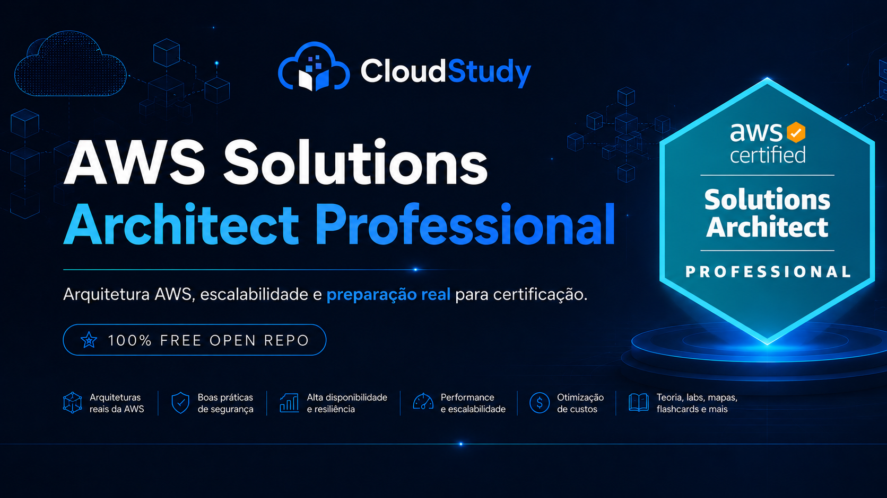



  

  

  <strong>Guia em PT-BR para estudar AWS Solutions Architect Professional (SAP-C02) com foco em cenários, trade-offs, governança, migração e decisões arquiteturais avançadas.</strong>

  <strong>Entre na lista de espera da CloudStudy e receba acesso antecipado à plataforma.</strong>

  

  

## Patrocínio educacional

  Este projeto conta com apoio da <a href="https://www.cloudstudy.com.br">CloudStudy</a>.

 

<h1 align="center">AWS Solutions Architect Professional (SAP-C02)</h1>

  
  
  

  
  
  
  
  

  <a href="#como-usar-este-repositorio">Como usar</a> •
  <a href="#fluxo-recomendado-de-estudo">Fluxo de estudo</a> •
  <a href="#roteiro-de-estudo">Roteiro</a> •
  <a href="#modulos">Módulos</a> •
  <a href="./30-Simulados-e-Questoes/README.md">Simulados</a> •
  <a href="#trilhas-complementares-aws">Trilhas AWS</a>

Material aberto por Thiago Cardoso • <a href="https://www.linkedin.com/in/analyticsthiagocardoso">LinkedIn</a>

---

## O que você vai encontrar neste repositório

| Tema | O que você encontra aqui |
|---|---|
| Arquitetura organizacional | Multi-account, AWS Organizations, Control Tower, governança e acesso cross-account. |
| Redes avançadas e híbridas | Transit Gateway, Direct Connect, VPN, DNS híbrido, PrivateLink e segmentação. |
| Novas soluções | Estratégias para compute, storage, bancos, integração, serverless e containers. |
| Melhoria contínua | Observabilidade, segurança, performance, confiabilidade, quotas e automação. |
| Disaster recovery | RTO/RPO, backup, replicação, testes e continuidade de negócio. |
| Migração e modernização | 7Rs, assessment, MGN, DMS, SCT, DataSync, Snow Family e modernização gradual. |
| Otimização de custos | FinOps, tagging, Cost Explorer, Budgets, Savings Plans e rightsizing. |
| Revisão e simulados | Questões no estilo SAP-C02, mini-simulados por domínio e caderno de erros. |

## 🚦 Por onde começar

- **Já domina fundamentos de arquitetura AWS:** comece pelo [Módulo 01](./01-Introducao-SAP-C02/README.md) e siga a sequência até governança, redes, novas soluções, melhoria contínua e migração.
- **Precisa reforçar base arquitetural:** revise a trilha de [Solutions Architect Associate](https://github.com/Thiago-code-lab/aws-certified-solutions-architect-associate-brasil) antes dos módulos mais avançados.
- **Reta final:** use [Simulados e Questões](./30-Simulados-e-Questoes/README.md), [mini-simulados por domínio](./30-Simulados-e-Questoes/mini-simulados-por-dominio.md), [caderno de erros](./30-Simulados-e-Questoes/caderno-de-erros.md) e [reta final SAP-C02](./30-Simulados-e-Questoes/reta-final-sap-c02.md).

> Trilha aberta em Português do Brasil para preparação estruturada da certificação AWS Certified Solutions Architect Professional SAP-C02.

Repositório oficial: https://github.com/Thiago-code-lab/aws-certified-solutions-architect-professional-brasil

## 🎯 Sobre este Repositório

Este repositório organiza uma trilha de preparação para SAP-C02 com foco nos principais temas cobrados pela certificação Professional. O objetivo é treinar raciocínio arquitetural em cenários com múltiplas contas, ambientes híbridos, requisitos regulatórios, migração, modernização, continuidade, segurança e custo.

O material evita tratar serviços como definições isoladas. Cada módulo prioriza decisões: por que uma arquitetura atende melhor ao cenário, quando outra alternativa se torna preferível e quais restrições mudam a escolha.

## 📊 Estrutura e Domínios do Exame

| Domínio | Peso | O que cai na prática | Módulos principais |
|---|---:|---|---|
| Design Solutions for Organizational Complexity | 26% | Multi-account, governança, redes híbridas, segurança centralizada, resiliência organizacional e custos | 02, 03, 04, 05, 06, 07 |
| Design for New Solutions | 29% | Deployment, continuidade, segurança, confiabilidade, performance, dados, integração, serverless e containers | 08, 09, 10, 11, 12, 13, 14, 15, 16, 17 |
| Continuous Improvement for Existing Solutions | 25% | Observabilidade, segurança, performance, confiabilidade, quotas, automação e otimização de custo | 18, 19, 20, 21, 22, 27 |
| Accelerate Workload Migration and Modernization | 20% | Assessment, 7Rs, migração de workloads e dados, modernização e refatoração gradual | 23, 24, 25, 26, 28, 29 |

## 🗺️ Mapa de Estudos

### Semana 1
- Módulos 01 a 04: mentalidade SAP-C02, Organizations, identidade, federação, SCPs, RAM e governança.

### Semana 2
- Módulos 05 a 07: redes avançadas, Transit Gateway, conectividade híbrida, DNS, PrivateLink e segurança de rede.

### Semana 3
- Módulos 08 a 10: compute, Auto Scaling, alta disponibilidade, multi-Region, Route 53, CloudFront e Global Accelerator.

### Semana 4
- Módulos 11 a 13: armazenamento, bancos relacionais, DynamoDB, cache e bancos purpose-built.

### Semana 5
- Módulos 14 a 16: mensageria, eventos, Step Functions, serverless e containers.

### Semana 6
- Módulos 17 e 18: IaC, CI/CD, deployment, rollback, observabilidade, auditoria e conformidade.

### Semana 7
- Módulos 19 a 21: segurança centralizada, DR, backup, RTO/RPO, performance, reliability e quotas.

### Semana 8
- Módulos 22 e 23: FinOps, cost visibility, Migration Hub, discovery, TCO e estratégia dos 7Rs.

### Semana 9
- Módulos 24 a 27: migração de workloads e dados, modernização, decoupling e Well-Architected avançado.

### Semana 10
- Módulos 28 a 31: casos reais, labs práticos, simulados, glossário e recursos oficiais.

## 📁 Módulos

| # | Módulo | Domínio predominante | Status | Link |
|---|---|---|---|---|
| 01 | Introdução SAP-C02 | Base / Estratégia | Aberto | [README](./01-Introducao-SAP-C02/README.md) |
| 02 | Organizations, Control Tower e Multi-Account | Organizational Complexity | Aberto | [README](./02-Organizations-Control-Tower-e-Multi-Account/README.md) |
| 03 | IAM, Identity Center, Federação e Cross-Account | Organizational Complexity | Aberto | [README](./03-IAM-Identity-Center-Federacao-e-Cross-Account/README.md) |
| 04 | Governança, SCPs, RAM e Service Catalog | Organizational Complexity | Aberto | [README](./04-Governanca-SCPs-RAM-e-Service-Catalog/README.md) |
| 05 | Redes Avançadas, VPC e Transit Gateway | Organizational Complexity | Aberto | [README](./05-Redes-Avancadas-VPC-e-Transit-Gateway/README.md) |
| 06 | Conectividade Híbrida, Direct Connect, VPN e DNS | Organizational Complexity | Aberto | [README](./06-Conectividade-Hibrida-Direct-Connect-VPN-e-DNS/README.md) |
| 07 | PrivateLink, Network Firewall, WAF e Shield | Organizational Complexity / Security | Aberto | [README](./07-PrivateLink-Network-Firewall-WAF-e-Shield/README.md) |
| 08 | EC2, Auto Scaling e Estratégias de Compute | Design for New Solutions | Aberto | [README](./08-EC2-Auto-Scaling-e-Estrategias-de-Compute/README.md) |
| 09 | Alta Disponibilidade, Multi-AZ e Multi-Region | Design for New Solutions | Aberto | [README](./09-Alta-Disponibilidade-Multi-AZ-e-Multi-Region/README.md) |
| 10 | Route 53, CloudFront e Global Accelerator | Design for New Solutions | Aberto | [README](./10-Route53-CloudFront-e-Global-Accelerator/README.md) |
| 11 | S3, EBS, EFS, FSx e Estratégias de Armazenamento | Design for New Solutions | Aberto | [README](./11-S3-EBS-EFS-FSx-e-Estrategias-de-Armazenamento/README.md) |
| 12 | RDS, Aurora e Estratégias de Banco Relacional | Design for New Solutions | Aberto | [README](./12-RDS-Aurora-e-Estrategias-de-Banco-Relacional/README.md) |
| 13 | DynamoDB, ElastiCache e Bancos Purpose-Built | Design for New Solutions | Aberto | [README](./13-DynamoDB-ElastiCache-e-Bancos-Purpose-Built/README.md) |
| 14 | SQS, SNS, EventBridge e Step Functions | Design for New Solutions | Aberto | [README](./14-SQS-SNS-EventBridge-e-Step-Functions/README.md) |
| 15 | Lambda, API Gateway e Arquiteturas Serverless | Design for New Solutions | Aberto | [README](./15-Lambda-API-Gateway-e-Arquiteturas-Serverless/README.md) |
| 16 | ECS, EKS, Fargate e Containers | Design for New Solutions | Aberto | [README](./16-ECS-EKS-Fargate-e-Containers/README.md) |
| 17 | CloudFormation, CI/CD e Estratégias de Deployment | Design for New Solutions | Aberto | [README](./17-CloudFormation-CICD-e-Estrategias-de-Deployment/README.md) |
| 18 | CloudWatch, CloudTrail, Config e Observabilidade | Continuous Improvement | Aberto | [README](./18-CloudWatch-CloudTrail-Config-e-Observabilidade/README.md) |
| 19 | Segurança: KMS, Secrets, GuardDuty e Security Hub | Continuous Improvement / Security | Aberto | [README](./19-Seguranca-KMS-Secrets-GuardDuty-e-Security-Hub/README.md) |
| 20 | Disaster Recovery, Backup, RTO e RPO | Continuous Improvement | Aberto | [README](./20-Disaster-Recovery-Backup-RTO-e-RPO/README.md) |
| 21 | Performance, Reliability e Service Quotas | Continuous Improvement | Aberto | [README](./21-Performance-Reliability-e-Service-Quotas/README.md) |
| 22 | Otimização de Custos e FinOps | Continuous Improvement | Aberto | [README](./22-Otimizacao-de-Custos-e-FinOps/README.md) |
| 23 | Migration Hub, Discovery e Estratégia dos 7Rs | Migration and Modernization | Aberto | [README](./23-Migration-Hub-Discovery-e-Estrategia-dos-7Rs/README.md) |
| 24 | MGN, DMS, SCT e Migração de Workloads | Migration and Modernization | Aberto | [README](./24-MGN-DMS-SCT-e-Migracao-de-Workloads/README.md) |
| 25 | DataSync, Snow, Transfer Family e Transferência de Dados | Migration and Modernization | Aberto | [README](./25-DataSync-Snow-Transfer-Family-e-Transferencia-de-Dados/README.md) |
| 26 | Modernização: Serverless, Containers e Decoupling | Migration and Modernization | Aberto | [README](./26-Modernizacao-Serverless-Containers-e-Decoupling/README.md) |
| 27 | Well-Architected e Trade-Offs Avançados | Todos os domínios | Aberto | [README](./27-Well-Architected-e-Trade-Offs-Avancados/README.md) |
| 28 | Casos de Uso Reais | Todos os domínios | Aberto | [README](./28-Casos-de-Uso-Reais/README.md) |
| 29 | Labs Práticos | Prática | Aberto | [README](./29-Labs-Praticos/README.md) |
| 30 | Simulados e Questões | Revisão final | Aberto | [README](./30-Simulados-e-Questoes/README.md) |
| 31 | Glossário e Recursos | Revisão / Recursos | Aberto | [README](./31-Glossario-e-Recursos/README.md) |

## 🧩 Maturidade atual dos módulos

Esta tabela mostra o estado editorial real da fase atual. Alguns módulos já têm conteúdo flagship inicial; outros ainda funcionam como trilha, índice ou estrutura de expansão.

| Nome do módulo | Papel atual | Profundidade | Lab |
|---|---|---|---|
| [01 - Introdução SAP-C02](./01-Introducao-SAP-C02/README.md) | Onboarding | Estrutura inicial | Não |
| [02 - Organizations, Control Tower e Multi-Account](./02-Organizations-Control-Tower-e-Multi-Account/README.md) | Flagship | Aprofundado | Não |
| [03 - IAM, Identity Center, Federação e Cross-Account](./03-IAM-Identity-Center-Federacao-e-Cross-Account/README.md) | Suporte | Estrutura inicial | Não |
| [04 - Governança, SCPs, RAM e Service Catalog](./04-Governanca-SCPs-RAM-e-Service-Catalog/README.md) | Suporte | Estrutura inicial | Não |
| [05 - Redes Avançadas, VPC e Transit Gateway](./05-Redes-Avancadas-VPC-e-Transit-Gateway/README.md) | Flagship | Aprofundado | Guiado |
| [06 - Conectividade Híbrida, Direct Connect, VPN e DNS](./06-Conectividade-Hibrida-Direct-Connect-VPN-e-DNS/README.md) | Suporte | Estrutura inicial | Rascunho |
| [07 - PrivateLink, Network Firewall, WAF e Shield](./07-PrivateLink-Network-Firewall-WAF-e-Shield/README.md) | Suporte | Estrutura inicial | Rascunho |
| [08 - EC2, Auto Scaling e Estratégias de Compute](./08-EC2-Auto-Scaling-e-Estrategias-de-Compute/README.md) | Suporte | Estrutura inicial | Não |
| [09 - Alta Disponibilidade, Multi-AZ e Multi-Region](./09-Alta-Disponibilidade-Multi-AZ-e-Multi-Region/README.md) | Suporte | Estrutura inicial | Rascunho |
| [10 - Route 53, CloudFront e Global Accelerator](./10-Route53-CloudFront-e-Global-Accelerator/README.md) | Suporte | Estrutura inicial | Rascunho |
| [11 - S3, EBS, EFS, FSx e Estratégias de Armazenamento](./11-S3-EBS-EFS-FSx-e-Estrategias-de-Armazenamento/README.md) | Suporte | Estrutura inicial | Rascunho |
| [12 - RDS, Aurora e Estratégias de Banco Relacional](./12-RDS-Aurora-e-Estrategias-de-Banco-Relacional/README.md) | Suporte | Estrutura inicial | Rascunho |
| [13 - DynamoDB, ElastiCache e Bancos Purpose-Built](./13-DynamoDB-ElastiCache-e-Bancos-Purpose-Built/README.md) | Suporte | Estrutura inicial | Não |
| [14 - SQS, SNS, EventBridge e Step Functions](./14-SQS-SNS-EventBridge-e-Step-Functions/README.md) | Suporte | Estrutura inicial | Rascunho |
| [15 - Lambda, API Gateway e Arquiteturas Serverless](./15-Lambda-API-Gateway-e-Arquiteturas-Serverless/README.md) | Suporte | Estrutura inicial | Rascunho |
| [16 - ECS, EKS, Fargate e Containers](./16-ECS-EKS-Fargate-e-Containers/README.md) | Suporte | Estrutura inicial | Rascunho |
| [17 - CloudFormation, CI/CD e Estratégias de Deployment](./17-CloudFormation-CICD-e-Estrategias-de-Deployment/README.md) | Suporte | Estrutura inicial | Rascunho |
| [18 - CloudWatch, CloudTrail, Config e Observabilidade](./18-CloudWatch-CloudTrail-Config-e-Observabilidade/README.md) | Suporte | Estrutura inicial | Rascunho |
| [19 - Segurança: KMS, Secrets, GuardDuty e Security Hub](./19-Seguranca-KMS-Secrets-GuardDuty-e-Security-Hub/README.md) | Suporte | Estrutura inicial | Não |
| [20 - Disaster Recovery, Backup, RTO e RPO](./20-Disaster-Recovery-Backup-RTO-e-RPO/README.md) | Flagship | Aprofundado | Guiado |
| [21 - Performance, Reliability e Service Quotas](./21-Performance-Reliability-e-Service-Quotas/README.md) | Suporte | Estrutura inicial | Não |
| [22 - Otimização de Custos e FinOps](./22-Otimizacao-de-Custos-e-FinOps/README.md) | Suporte | Estrutura inicial | Rascunho |
| [23 - Migration Hub, Discovery e Estratégia dos 7Rs](./23-Migration-Hub-Discovery-e-Estrategia-dos-7Rs/README.md) | Suporte | Estrutura inicial | Rascunho |
| [24 - MGN, DMS, SCT e Migração de Workloads](./24-MGN-DMS-SCT-e-Migracao-de-Workloads/README.md) | Suporte | Estrutura inicial | Rascunho |
| [25 - DataSync, Snow, Transfer Family e Transferência de Dados](./25-DataSync-Snow-Transfer-Family-e-Transferencia-de-Dados/README.md) | Suporte | Estrutura inicial | Rascunho |
| [26 - Modernização: Serverless, Containers e Decoupling](./26-Modernizacao-Serverless-Containers-e-Decoupling/README.md) | Suporte | Estrutura inicial | Rascunho |
| [27 - Well-Architected e Trade-Offs Avançados](./27-Well-Architected-e-Trade-Offs-Avancados/README.md) | Suporte | Estrutura inicial | Não |
| [28 - Casos de Uso Reais](./28-Casos-de-Uso-Reais/README.md) | Futuro hub de cenários | Estrutura inicial | Não |
| [29 - Labs Práticos](./29-Labs-Praticos/README.md) | Hub de labs | Índice prático | Não |
| [30 - Simulados e Questões](./30-Simulados-e-Questoes/README.md) | Revisão final | Estrutura inicial | Não |
| [31 - Glossário e Recursos](./31-Glossario-e-Recursos/README.md) | Referência | Curadoria inicial | Não |

## 🚀 Como Usar Este Repositório

1. Comece pelo módulo 01 para calibrar o nível Professional e a leitura de cenários longos.
2. Estude os módulos em ordem, porque governança, identidade e rede sustentam várias decisões posteriores.
3. Use cheatsheets e casos de uso para revisar critérios de decisão antes das questões.
4. Registre erros recorrentes no caderno de erros do módulo 30.
5. Priorize documentação oficial AWS quando houver dúvida sobre comportamento, limite ou recomendação atual.

## 🔁 Fluxo Recomendado de Estudo

1. Leia o README do módulo para entender contexto, decisões e trade-offs.
2. Revise cheatsheet.md antes de resolver questões.
3. Estude casos-de-uso.md procurando o requisito dominante de cada cenário.
4. Resolva questoes.md sem abrir o bloco de resposta.
5. Reforce lacunas com flashcards, links oficiais e mini-simulados por domínio.

## ✅ Checklist Curto de Revisão Final

- Diferenciar governança multi-account, SCPs, IAM Identity Center e acesso cross-account.
- Revisar Transit Gateway, Direct Connect, VPN, DNS híbrido, PrivateLink e inspeção centralizada.
- Comparar Multi-AZ, multi-Region, backup, active/passive, pilot light e warm standby.
- Treinar decisões entre bancos relacionais, DynamoDB, cache e bancos purpose-built.
- Revisar MGN, DMS, SCT, DataSync, Snow Family, 7Rs e wave planning.
- Refazer questões erradas antes de iniciar novos simulados.

## 🧭 Trilhas Complementares AWS

### AWS Solutions Architect Associate

https://github.com/Thiago-code-lab/aws-certified-solutions-architect-associate-brasil

Use como base arquitetural quando precisar revisar fundamentos de VPC, IAM, EC2, S3, bancos, serverless, containers, observabilidade, DR e Well-Architected antes de avançar para cenários Professional.

### AWS Cloud Practitioner

https://github.com/Thiago-code-lab/aws-certified-cloud-practitioner-brasil

Use para revisar fundamentos de cloud, modelo de responsabilidade compartilhada, pricing, billing, suporte e conceitos básicos da AWS quando necessário.

### AWS AI Practitioner

https://github.com/Thiago-code-lab/aws-certified-ai-practitioner-brasil

Use como trilha complementar quando os cenários envolverem IA generativa, Amazon Bedrock, workloads de IA, governança de IA ou modernização com recursos de AI/ML.

## ⚠️ Armadilhas comuns na prova

| Confusão frequente | Como decidir | Armadilha típica SAP-C02 |
|---|---|---|
| Multi-account vs conta única | Use multi-account para isolamento, governança, billing e blast radius | Resolver escala organizacional com permissões locais |
| Transit Gateway vs peering | TGW centraliza conectividade em escala; peering serve relações mais simples | Criar malha difícil de operar |
| Multi-AZ vs multi-Region | Multi-AZ reduz falha local; multi-Region atende continuidade global e DR mais exigente | Escolher multi-Region sem validar RTO/RPO e custo |
| DMS vs SCT vs MGN | DMS move dados, SCT converte schema, MGN replica servidores | Usar ferramenta de migração errada para o tipo de workload |
| WAF vs Shield vs Network Firewall | WAF protege HTTP, Shield mitiga DDoS, Network Firewall inspeciona tráfego de rede | Aplicar proteção na camada errada |
| Cost Explorer vs CUR vs Budgets | Explorer analisa, CUR detalha, Budgets alerta | Confundir visibilidade com controle preventivo |

## 🤝 Como contribuir

Consulte [CONTRIBUTING.md](./CONTRIBUTING.md) para abrir issues, propor labs/questões e enviar pull requests de forma padronizada e objetiva.

Contribuições são bem-vindas, especialmente para:

- corrigir detalhes técnicos e limites de serviço
- melhorar cenários de questões e explicações de alternativas
- atualizar mudanças recentes dos serviços AWS
- adicionar diagramas ASCII claros e labs econômicos

## 📦 Releases

Para atualizações relevantes de conteúdo, consulte a página de Releases no GitHub e o histórico em [CHANGELOG.md](./CHANGELOG.md).

## 📄 Licença

MIT

## ✅ Qualidade do conteúdo e última revisão

- O conteúdo usa documentação oficial da AWS como referência prioritária.
- Os exemplos e labs priorizam decisões arquiteturais, custo controlado e baixo risco para estudo.
- O repositório deve ser atualizado conforme mudanças em serviços AWS e no guia do exame SAP-C02.

**Última revisão global:** 11/08/2026.
